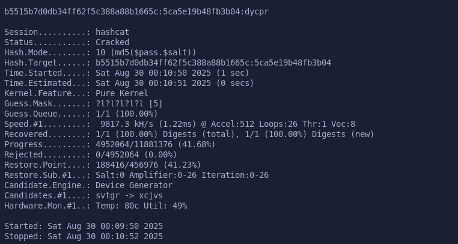
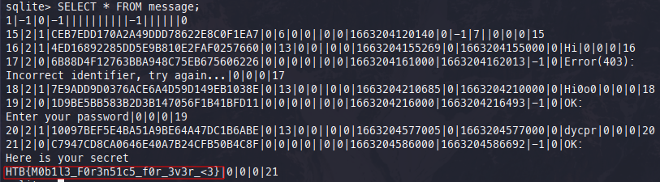
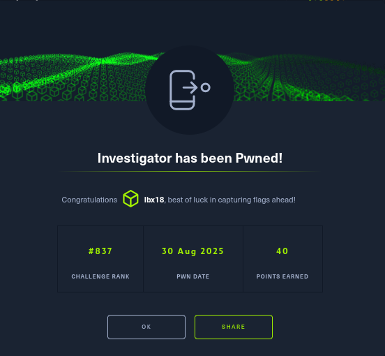

# CHALLENGE DESCRIPTION

In one of the mobile forensics investigations we encountered, our agent gave us these files and told us that their owner using one password for almost everything. Can you extract the flag from the secret messages?

## Summery

### backup file

- backup.ab

It seems to contain a lot of data, but it is protected by a password. I have not been able to crack it yet.

---

### locksettings file

From so far this file is the one that contained a juice data.

```sql
sqlite> SELECT * FROM locksettings;
2|lockscreen.disabled|0|1
3|migrated|0|true
4|migrated_user_specific|0|true
5|lockscreen.enabledtrustagents|0|
6|lockscreen.password_salt|0|6675990079707233028
12|lock_pattern_autolock|0|0
14|lockscreen.password_type_alternate|0|0
15|lockscreen.password_type|0|262144
16|lockscreen.passwordhistory|0|
```

- Lockscreen password_salt: **6675990079707233028**
- Lockscreen password_type: **262144** (indicates a PIN is set)
- Salt conversion into hex: **5ca5e19b48fb3b04**

---

### Password Key

This one, I don't personally have any idea how to exploit this find right now. But I am sure as log I keep pushing forward there will be way for me to use it.

- **E135432C47718760B2FD7AF5CFF7A7608A926ED6 B5515B7D0DB34FF62F5C388A88B1665C**

### Devices Policy

```xml
<policies setup-complete="true">
<active-password quality="262144" length="5" uppercase="0" lowercase="5" letters="5" numeric="0" symbols="0" nonletter="0" />
</policies>
```

---

### Required files

The main files related to locking are located in /data/system/. You will need to extract the following files from the target device.

- **gesture.key**: This file contains the hashed pattern lock information.
- **password.key**: This file contains the hashed password or PIN information.
- **locksettings.db**: This SQLite database contains various settings related to the lock screen, including the salt used for hashing passwords and PINs.
- **devices_policy.xml**: This XML file contains device policy settings, which may include information about password complexity requirements.
- **locksettings.db-wal**: This is a write-ahead log file for the locksettings.db database, which may contain additional information.
- **locksettings.db-shm**: This is a shared memory file for the locksettings.db database.

### Check requirements

- [x] gesture.key

- [x] password.key

- [x] locksettings.db

- [x] devices_policy.xml

## Crack the Password

- [x] SHA1 **E135432C47718760B2FD7AF5CFF7A7608A926ED6**
- [x] MD5 **B5515B7D0DB34FF62F5C388A88B1665C**
- [x] Salt **5ca5e19b48fb3b04**
- [x] Password Type **262144** (indicates a PIN is set, and the length is 5 digits lower case)

### Hashcat

For this process to go smoothly, I need to understand how the password is hashed.

|Hash Type |Function           |Speed        |
|----------|-------------------|-------------|
|10        |MD5($pass . $salt) | 1077.8 MH/.s|
|110       |SHA1($pass . $salt)| 261.4 MH/s  |

### Hashcat Commands structure

```bash
hashcat -m <hash_type> <hash>:<salt> -a 3 "?l?l?l?l?l"
```

---

### md5

```bash
hashcat -m 10 B5515B7D0DB34FF62F5C388A88B1665C:5ca5e19b48fb3b04  -a 3 "?l?l?l?l?l"
```

---

### sha1

```bash
hashcat -m 110 -a 3 E135432C47718760B2FD7AF5CFF7A7608A926ED6:5ca5e19b48fb3b04 "?l?l?l?l?l"  
```

### Decrypted hash

b5515b7d0db34ff62f5c388a88b1665c:5ca5e19b48fb3b04:**dycpr**
After  this step, I was able decrypt the backup.ab file using the password **dycpr**.


Within the backup.ab folder, I stumbled upon several whatsapp crypt14 files. Not knowing how to decrypt them, I turned to google and discovered a tool named  **[wa-crypt-tools](https://github.com/ElDavoo/wa-crypt-tools)**.

### wa-crypt-tools installation

```bash
pipx install wa-crypt-tools
```

### WhatsApp key file location

To decrypt WhatsApp messages, I need the key file, which is located in the path below:

```bash
/data/data/com.whatsapp/files/key
```

I copied the key file and the crypt14 files to my local machine and used the following command to decrypt them:

```bash
wadecrypt  -f key msgstore.db.crypt14  msgstore.db
```

The decrypted file is **msgstore.db**. I opened it with DB Browser for SQLite and found the flag in the messages table.
**HTB{M0b1l3_F0r3n51c5_f0r_3v3r_<3}**


### Pawned

