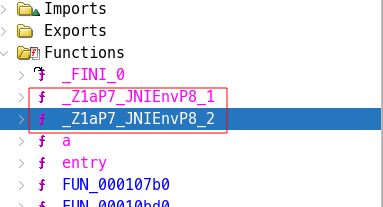
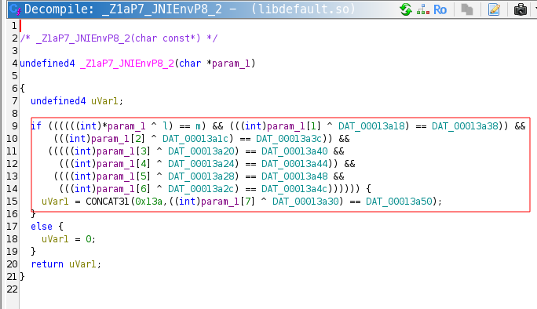
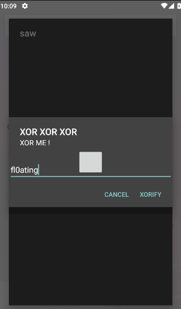
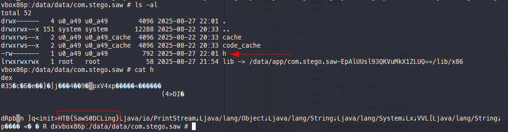
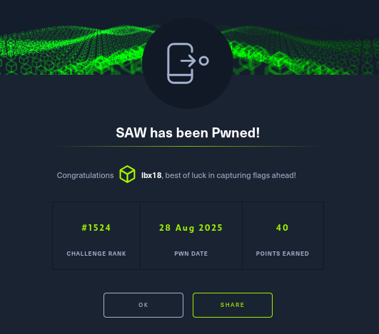

# Mobile Challenge SAW

---

Challenge:The malware forensics lab identified a new technique for hiding and executing code dynamically. A sample that seems to use this technique has just arrived in their queue. Can you help them?

### First Analysis

1- I used bytecode tool to check the source code.
2- I used jdax to also check the source code.
3- I used apktool to decompile the APK.

```bash
apktool d Saw.apk
```

---

### Run the APK on an emulator

- I used adb to install the Saw.apk file on my emulator.

Check **CPU Architecture**: Use the following command to check the CPU architecture:

```bash
adb shell getprop ro.product.cpu.abi
```

- Install the apk file:

```bash
adb install -r Saw.apk
```

- run the main activity of the apk:

```bash
adb shell am start -n com.stego.saw/.MainActivity --es open sesame
```

---

### Issues

The app is not running. So, I checked the logcat to find the reason behind that.

The apk just crashed after clicking. So , this command is the one that let you check the log, and find the reason behind the crash. It was some permission issue

```bash
adb logcat | grep -i "com.stego.saw"
```

I found that the app is asking for SYSTEM_ALERT_WINDOW permission. So, I need to grant it. **Un-granting permission android.permission.SYSTEM_ALERT_WINDOW from package com.stego.saw (protectionLevel=1250 flags=0x3048be44)**

- Time to grant the permission to the apk.

```bash
adb shell appops set com.stego.saw SYSTEM_ALERT_WINDOW allow
```

---

### Notices

- libdefault.so is the native library used in this apk.

  - While  checking the native libraries of the apk, I found that there is a library for x86 architecture. I also found that the decompile code is obfuscated.
  - I also found a xor encryption function in the decompile code.





-To fully grasps this I used claude AI  to explain the code to me, and this how the AI explained it:

### XOR Decryption - Quick Summary

### The Problem

The code validates a password using XOR operations:

```c
if ((input[i] ^ key1[i]) == key2[i])  // Password is correct
```

## The Solution

Since XOR is reversible, I can solve for the password:

```c
If: (password[i] ^ key1[i]) == key2[i]
Then: password[i] = key1[i] ^ key2[i]
```

## Step-by-Step Process

1. **Extract the keys** from memory dump:
   - key1 values: `[0x0A, 0x0B, 0x18, 0x0F, 0x5E, 0x31, 0x0C, 0x0F]`
   - key2 values: `[0x6C, 0x67, 0x28, 0x6E, 0x2A, 0x58, 0x62, 0x68]`

2. **Apply XOR to each position**:

   ```c
   password[0] = 0x0A ^ 0x6C = 0x66 = 'f'
   password[1] = 0x0B ^ 0x67 = 0x6C = 'l'
   password[2] = 0x18 ^ 0x28 = 0x30 = '0'
   password[3] = 0x0F ^ 0x6E = 0x61 = 'a'
   password[4] = 0x5E ^ 0x2A = 0x74 = 't'
   password[5] = 0x31 ^ 0x58 = 0x69 = 'i'
   password[6] = 0x0C ^ 0x62 = 0x6E = 'n'
   password[7] = 0x0F ^ 0x68 = 0x67 = 'g'
   ```

3. **Convert hex to ASCII**: Result is `fl0ating`

### Key Insight

XOR encryption is symmetric - the same operation that encrypts also decrypts. By XORing the two known values (key1 and key2), I can recover the original password.

### Two steps closer to the flag!

After getting the encryption key, I used it to  where the apk was asking for a string to decrypt. Then, if the string is correct, the apk will send  a file which contains the flag.

- While entering the string, I found that will send the file in the apk data directory.



- I used adb to pull the file from the device.

```bash
adb pull /data/data/com.stego.saw/h
```



---

### Pawned!

The flag is: **HTB{SawS0DCLing}**



---

### Topics to check

- APK native libraries

  - Android applications can contain compiled, native libraries. **Native libraries are code that the developer wrote and then compiled for a specific computer architecture**. Most often, this means code that is written in C or C++.


